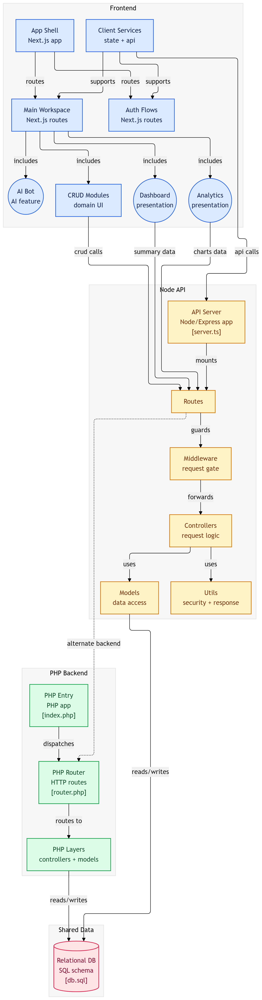

# 🏛️ Complaint Management System

A **full-stack complaint management platform** built entirely using **Next.js**, designed for government workflows across **District, Taluka, and Village levels**.

The system enables citizens to register complaints, officials to process them, and administrators to monitor performance through dashboards and analytics.

---

# 📌 Overview

This system provides a structured workflow for managing public complaints across administrative levels.

Supports:

* Citizen complaint submission 📝
* Multi-level governance workflow 🏛️
* Case tracking and updates
* Role-based dashboards
* Analytics and reporting 📊
* AI-powered assistant 🤖
* Secure authentication 🔐

Built using:

* **Next.js (Frontend + Backend)**
* **Next.js API Routes**
* **SQL Relational Database**
* **JWT Authentication**
* **Server-side APIs**

---

# 🧩 Architecture Summary

The system follows a **full-stack Next.js architecture**.

```text
Frontend (Next.js UI)
        │
        ▼
API Routes (Next.js Backend)
        │
        ▼
Controllers
        │
        ▼
Models / Data Access
        │
        ▼
SQL Database
```

---

# 🖥️ Frontend Layer

The frontend is built using **Next.js App Router**.

## Core Modules

* Auth flows 🔐
* Main workspace
* Complaint submission
* Complaint tracking
* Dashboard views 📊
* Analytics views 📈
* CRUD domain modules
* AI assistant 🤖

## Frontend Flow

```text
App Shell
│
├── Auth Routes
├── Main Workspace
│
├── Dashboard
├── Analytics
├── Complaint Modules
├── AI Bot
│
└── Client Services (State + API)
```

---

# ⚙️ Backend — Next.js API Routes

Backend logic is implemented using **Next.js API routes**, removing the need for a separate Express server.

## Responsibilities

* Request validation
* Authentication
* Role authorization
* Complaint processing
* Data management
* Response formatting

## Backend Flow

```text
API Route
   │
Middleware
   │
Controller
   │
Model
   │
Database
```

---

# 🗄️ Database Layer

Uses a **relational SQL database**.

Stores:

* Users
* Complaints
* Departments
* Locations
* Status updates
* Logs

Example entities:

```text
User
Complaint
District
Taluka
Village
Department
ComplaintStatus
```

---

# 🏛️ Governance Workflow

Designed for hierarchical government systems.

Flow:

```text
Citizen → Village → Taluka → District → Resolution
```

Each level can:

* Review complaints
* Assign responsibility
* Update status
* Escalate issues

---

# 🔐 Authentication & Roles

Uses **JWT-based authentication**.

Supported roles:

* Citizen
* Village Officer
* Taluka Officer
* District Officer
* Administrator

Each role has:

* Separate dashboards
* Permission-based access
* Scoped complaint visibility

---

# 🤖 AI Assistant

Integrated AI module supports:

* Complaint classification
* Suggested actions
* Summary generation
* Reporting assistance

---

# 📊 Dashboard & Analytics

Includes:

* Complaint statistics
* Resolution timelines
* Pending workloads
* Department performance
* Regional analytics

---

# 🚀 Installation

Clone repository:

```bash
git clone <repo-url>
cd complaint-system
```

Install dependencies:

```bash
npm install
```

Run development server:

```bash
npm run dev
```

---

# 🔧 Environment Variables

Example:

```env
DATABASE_URL=your_database_url
JWT_SECRET=your_secret
NEXTAUTH_SECRET=your_secret
AI_API_KEY=your_key
```

---

# 📦 Key Features

* Multi-level complaint routing 🏛️
* Complaint lifecycle tracking
* Role-based dashboards
* Secure authentication 🔐
* Data-driven analytics 📊
* AI-powered assistance 🤖
* Scalable modular design

---

# 📌 Use Cases

Suitable for:

* District-level governance
* Municipal complaint systems
* Rural administration workflows
* Government grievance portals
* Public service tracking

---

# 🧱 Architecture Principles


This project follows:

* Full-stack Next.js pattern
* Modular architecture
* Role-based access control
* API-driven UI
* Scalable workflow design

---

# 🛠️ Future Enhancements

Planned:

* Mobile notification system
* File attachments support
* GIS location mapping
* Real-time complaint updates
* Multi-language support

---

# 📄 License

Government or institutional project usage.
